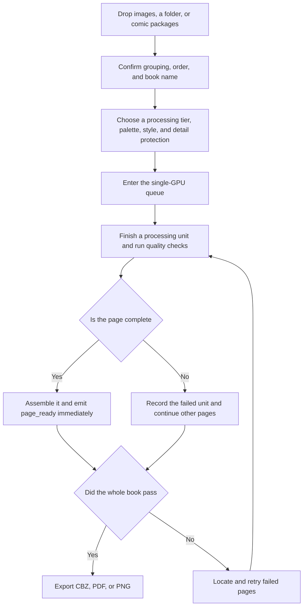

<div align="center">
  <h1 align="center">PanelTone</h1>
  <p>A local workbench for manga colorization and style redraw</p>
  <p><strong>0.2.0-alpha.1</strong> · Windows 11 first · Local processing · Chinese-first project</p>
  <p><a href="README.md">简体中文</a> · <a href="SECURITY.md">Security</a> · <a href="CONTRIBUTING.md">Contributing</a></p>
</div>

> PanelTone is a public alpha release. Task management, batch input, page-ready output, and deterministic detail protection are available, while generation quality still depends on the local model, source pages, and settings

<div align="center">
  
  <p>Figure 1.1 PanelTone desktop workbench using repository-owned synthetic manga data</p>
</div>

## 1. Capabilities

PanelTone combines import, page generation, deterministic source protection, failure recovery, and book export in one local Web workbench. End users do not need Node.js or knowledge of model graphs

| Status | Capability | Current boundary |
|---|---|---|
| Implemented | PNG, JPEG, WebP, TIFF, BMP, PDF, ZIP, CBZ, RAR, and CBR input | RAR and CBR require a local 7-Zip installation |
| Implemented | Multiple images become one book; archives and PDFs become separate books | Image order and the book name can be changed before creation |
| Implemented | Single-GPU queue, pause, resume, cancel, batch actions, and an in-app trash view | GPU inference stays serial while CPU preparation may run in parallel |
| Implemented | One global Server-Sent Events stream and page-ready previews | A completed page appears without waiting for the whole book |
| Implemented | Deterministic protection for text, balloons, panels, luminance, and ink | Strict mode prioritizes fidelity; generative mode permits broader pixel changes |
| Implemented | Explained color, style, detail, panel, and export presets | Presets affect prompts and post-processing; the model still determines the result |
| Experimental | FLUX.2 Klein 4B local service and automatic download | Weights are not included; review the license and disk use before downloading |
| Planned | Cross-page character memory, reference retrieval, Cobra, and advanced hard-page repair | These are not released as stable features |

Table 1.1 Capability boundaries in this alpha

## 2. Quick start

### 2.1. Windows 11

Python `3.11` or `3.12` is required. The repository includes the built interface, so end users do not need Node.js

```powershell
# Create the local Python environment and install PanelTone without model weights
powershell -ExecutionPolicy Bypass -File scripts/install.ps1

# Start the localhost-only workbench at http://127.0.0.1:8765
powershell -ExecutionPolicy Bypass -File scripts/start_app.ps1
```

Use the built-in deterministic engine to verify import, protection, queueing, and export first. Before real generation, open “Models and local storage,” review the model source and license, then download or connect the local model service

### 2.2. Manual Linux path

The Linux path has not received desktop acceptance testing in this project environment

```bash
# Create an isolated environment to avoid changing system Python
python3.11 -m venv .venv

# Activate it and install PanelTone from this checkout
source .venv/bin/activate
python -m pip install -e .

# Bind the workbench to the loopback interface only
paneltone --engines configs/engines.example.json serve --host 127.0.0.1 --port 8765
```

## 3. Book workflow

The flow keeps uploads, the GPU queue, page-ready delivery, and failure recovery in one resumable task



Figure 3.1 Whole-book processing and recovery

The site uses one Server-Sent Events connection. The browser reconnects automatically, and a database snapshot realigns task, page, and queue state

## 4. Detail protection

Strict mode does not replace the source with the full model output. It preserves source luminance and deterministically restores protected pixels and pure-black ink, allowing text, balloons, panel borders, and critical lines to remain unchanged

There are two distinct product boundaries:

- Strict content lock changes color, selected lighting, and material while protecting text and ink
- Full style redraw permits line, face rendering, and shadow changes, so it cannot promise pixel-identical content outside protected regions

The workbench can display the source, final page, protection mask, and a draggable comparison

## 5. Batch input and tasks

- Images are naturally sorted into one book and can be reordered before creation
- ZIP, CBZ, RAR, CBR, and PDF files each become a separate book in one batch
- SHA-256 detects duplicate sources
- ZIP validation rejects path traversal, nested archives, abnormal compression ratios, and excessive member counts

Settings become immutable after a task starts. Use “Duplicate and adjust” when a different configuration is needed

## 6. Models and hardware

The repository contains a pinned model manifest and download filters, not weights, caches, or user LoRAs. The current manifest includes FLUX.2 Klein 4B, with source and license links shown before download

RTX 4080 16GB is the primary local target. CPU offload is enabled by default for the model service, but speed depends on model choice, resolution, panel count, and retries

The built-in `palette` engine only verifies queueing, composition, protection, and export. It is not evidence of AI colorization quality or performance

## 7. Local data and security

PanelTone binds to `127.0.0.1` by default. Tasks, pages, SQLite databases, logs, and outputs stay in a user-writable local data directory. Browser APIs use opaque `source_id` values and do not return server absolute paths

The only default external network action is a user-confirmed model download. The project contains no telemetry, cloud image upload, or remote generation service

Local-path import can read files available to the current account. Set `PANELTONE_ALLOWED_ROOTS` to restrict access. On Windows, separate roots with semicolons

Permanent deletion is available only from trash and requires typing the confirmation phrase. It removes the task database, pages, and outputs and cannot be undone

## 8. Verification

The release candidate uses these checks on Windows:

```powershell
# Check Python formatting and common defects
.\.venv\Scripts\python -m ruff check src tests

# Run import, archive safety, queue, recovery, protection, API, and 300-page stress tests
.\.venv\Scripts\python -m pytest -q

# Compile the React and TypeScript interface shipped in the Python package
Set-Location src\manga_repaint\web\frontend
npm run build
```

Automated coverage includes count, order, and duplicate checks for a 300-page synthetic book. Browser acceptance covers `1440×900`, `1280×900`, and `390×844`, with no page-level horizontal overflow observed

<div align="center">
  
  <p>Figure 8.1 PanelTone mobile preview at 390×844 using synthetic data</p>
</div>

These checks establish the repository workflow and interface baseline. They do not prove equal generation quality across all manga, models, or adult-content inputs

## 9. Limitations

- This is an alpha; APIs and task database migrations may change
- The FLUX.2 Klein 4B service is experimental, and first load or large pages can take time
- RAR and CBR require 7-Zip
- Automatic panel detection, identity consistency, and cross-page color memory need broader book testing
- A complete line-art style change and pixel-identical content cannot be guaranteed at the same time

## 10. Contributing and security

See [CONTRIBUTING.md](CONTRIBUTING.md) for development checks. Report security issues through GitHub private security reporting on this repository's Security page, not a public issue containing manga pages, absolute paths, logs, or secrets

## 11. License and content boundary

PanelTone source is intended for release under the [Apache License 2.0](LICENSE). Models, ControlNet files, LoRAs, training material, and source manga keep their own licenses; see [THIRD_PARTY_NOTICES.md](THIRD_PARTY_NOTICES.md)

Adult content is limited to lawful fictional works that the user is authorized to process and whose characters are clearly adults. Content involving minors, ambiguous age, minor-coded characters, non-consensual material, or other illegal content is unsupported
