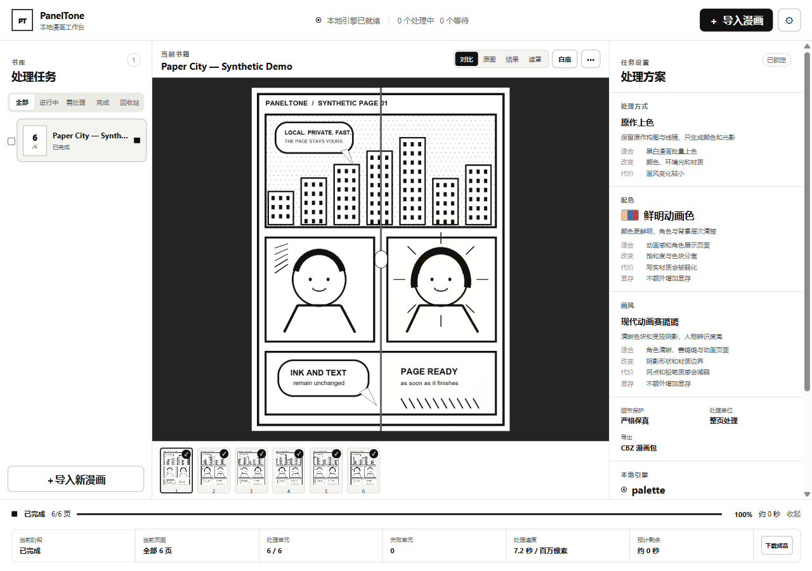
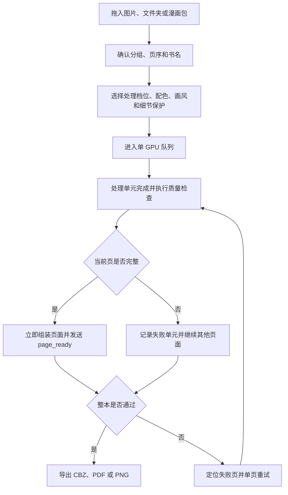
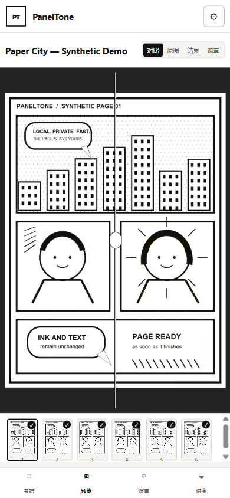

<div align="center">
  <h1 align="center">PanelTone</h1>
  <p>本地漫画上色与画风重绘工作台</p>
  <p><strong>0.2.0-alpha.3</strong> · Windows 11 优先 · 本机处理 · 中文优先</p>
  <p><a href="README.en.md">English</a> · <a href="SECURITY.md">安全报告</a> · <a href="CONTRIBUTING.md">参与贡献</a></p>
</div>

> PanelTone 当前是本地优先的公开 alpha 版本，任务管理、批量输入、逐页输出和确定性细节保护已经可用；生成质量仍取决于本地模型、输入页面与参数，不应当视为成熟或生产稳定软件

<div align="center">
  
  <p>图 1.1 PanelTone 桌面工作台，画面只使用仓库内的合成漫画数据</p>
</div>

## 1. 能做什么

PanelTone 把漫画导入、逐页生成、原图保护、失败恢复与整本导出集中在一个本地 Web 工作台中；普通用户不需要理解具体模型节点，也不需要安装 Node.js

WebP 是一种网页图片格式，PanelTone 把它作为漫画页面输入并统一转换为任务页

| 状态 | 能力 | 当前边界 |
|---|---|---|
| 已实现 | PNG、JPEG、WebP、TIFF、BMP、PDF、ZIP、CBZ、RAR、CBR 导入 | RAR 与 CBR 需要本机安装 7-Zip |
| 已实现 | 多张图片合成一本，多份压缩包与 PDF 分别建书 | 建书前可以调整图片顺序与书名 |
| 已实现 | 单 GPU 队列、暂停、继续、取消、批量操作与应用内回收站 | GPU 推理保持单任务，CPU 预处理可以并行 |
| 已实现 | 全局服务器发送事件流与逐页实时预览 | 页面组装完成后立即进入页带，不等待整本结束 |
| 已实现 | 文字、气泡、分镜、亮度与墨线确定性保护 | 严格模式优先保真，生成优先模式允许更多像素变化 |
| 已实现 | 配色、画风、细节模式、处理单位与导出格式说明 | 预设决定提示与后处理，实际效果仍由模型决定 |
| 试验中 | FLUX.2 Klein 4B 本地服务与自动下载 | 权重不在仓库中，首次下载前需要核对许可证与磁盘空间 |
| 规划中 | 角色跨页记忆、参考检索、Cobra 与困难页高级修复 | 尚未作为稳定能力发布 |

表 1.1 当前版本的能力范围

## 2. 快速开始

### 2.1. Windows 11

需要 Python `3.11` 或 `3.12`；普通安装使用仓库内已经构建的界面，不需要 Node.js

```powershell
# 创建本地 Python 环境并安装 PanelTone，不下载模型权重
powershell -ExecutionPolicy Bypass -File scripts/install.ps1

# 启动只绑定 127.0.0.1 的工作台，浏览器入口为 http://127.0.0.1:8765
powershell -ExecutionPolicy Bypass -File scripts/start_app.ps1
```

首次打开后可以先使用内置确定性测试引擎验证导入、保护、队列与导出；准备生成真实效果时，在“模型与本地存储”中核对模型来源和许可证，再下载或连接本地模型服务

### 2.2. Linux 手动路径

Linux 路径当前未在本项目环境中完成桌面验收，只提供手动启动方式

```bash
# 创建隔离环境，避免影响系统 Python
python3.11 -m venv .venv

# 激活环境并安装 PanelTone 源码包
source .venv/bin/activate
python -m pip install -e .

# 启动本地工作台，只监听回环地址
paneltone --engines configs/engines.example.json serve --host 127.0.0.1 --port 8765
```

## 3. 从导入到整本输出

这条流程把上传、GPU 队列、逐页发布和失败恢复串在一起；任何页面失败时，其他页面继续处理，整本任务进入“需要检查”而不是丢失进度



图 3.1 PanelTone 的整本处理与失败恢复流程

全站只建立 `1` 条服务器发送事件（Server-Sent Events，SSE）连接；断线后浏览器自动重连，数据库快照会重新校准任务、页面和队列状态

## 4. 细节保护

严格模式不会把模型完整输出直接覆盖原稿；系统先保留原始亮度，再回贴受保护区域与纯黑墨线，因此对话框、字体、分镜边框和关键线条可以逐像素保持

两种产品边界必须分开理解：

- 严格内容锁定只改变颜色、部分光影和材质，适合要求文字与线稿稳定的页面
- 完整画风重绘允许线条、五官画法和阴影形状变化，只能保证受保护文字与主要布局，不承诺像素级内容不变

保护结果可以在工作台中切换查看原图、最终图、保护遮罩与左右拖动对比

## 5. 批量输入与任务管理

导入规则保持简单：

- 多张图片按自然文件名排序并合成一本，建书前可以拖动调整
- 多个 ZIP、CBZ、RAR、CBR 或 PDF 分别建书，再一次加入队列
- 重复来源按照 SHA-256 识别，界面跳过相同内容
- ZIP 拒绝目录穿越、嵌套压缩包、异常压缩比和超过上限的文件数

任务开始后处理参数锁定；需要修改时使用“复制并调整”，避免同一本书中混入不同设置

## 6. 模型与硬件

仓库只保存模型清单、固定修订号和下载规则，不保存权重、缓存或用户 LoRA；当前清单包含 FLUX.2 Klein 4B，许可证与来源链接会在下载确认界面显示

RTX 4080 16GB 是当前首要本地目标；模型服务默认启用 CPU 卸载，64GB 系统内存可以承接暂时不在显存中的组件，但实际速度取决于模型、分辨率、分镜数量和重试次数

内置 `palette` 只用于验证队列、合成、保护和导出，不代表 AI 上色质量，也不用于性能宣传

## 7. 本地数据与安全边界

PanelTone 默认只绑定 `127.0.0.1`，任务、页面、SQLite 数据库、日志和输出保存在当前用户可写的数据目录；浏览器接口使用不透明的 `source_id`，不会返回服务器绝对路径

默认外部网络动作只有用户确认后的模型下载；工作台不包含遥测、云端图片上传或远程生成接口

本地路径导入能够读取当前账户有权访问的文件；需要限制范围时设置 `PANELTONE_ALLOWED_ROOTS`，多个目录在 Windows 上使用分号分隔

远程入口不是默认部署能力。需要自行提供私有入口时，应让 PanelTone 继续只监听本机回环地址，并在受控网关上叠加 HTTPS 与单点登录。反向 SSH 端口转发可以使用参数化形式 `127.0.0.1:${GATEWAY_PORT} → 127.0.0.1:${PANELTONE_PORT}`；网关主机、用户、密钥、域名与业务路径必须保存在仓库外的私有配置中

仓库提供 `scripts/maintain_reverse_tunnel.ps1` 与 `scripts/install_reverse_tunnel_task.ps1` 作为参数化运维模板；前者启用转发失败退出、30 秒保活、自动重连和本地日志轮转，后者以当前低权限 Windows 用户注册登录时启动的计划任务

永久删除只允许从回收站执行，并要求输入“永久删除”；删除会移除任务数据库、页面和输出，无法恢复

## 8. 验证状态

当前发布候选在 Windows 环境执行以下检查：

```powershell
# 检查 Python 代码格式与常见错误
.\.venv\Scripts\python -m ruff check .

# 运行批量导入、压缩包安全、队列、恢复、保护、API 和 300 页压力测试
.\.venv\Scripts\python -m pytest -q

# 编译 React 与 TypeScript 界面并输出随 Python 包发布的静态文件
Set-Location src\manga_repaint\web\frontend
npm run build
```

自动测试覆盖 `300` 页合成漫画的页数、顺序和重复项；浏览器验收覆盖 `1526×986`、`1440×900`、`1280×900`、`1024×768` 与 `390×844`，用于确认桌面、窄屏与移动端没有页面级横向溢出

<div align="center">
  
  <p>图 8.1 PanelTone 在 390×844 视口中的移动预览，使用合成数据</p>
</div>

这些检查证明当前仓库的任务流程和界面基线，不证明所有漫画、所有模型或所有成人内容都能达到相同生成质量

## 9. 当前限制

- 版本仍为 alpha，接口和任务数据库可能在后续版本迁移
- FLUX.2 Klein 4B 服务属于试验集成，首次加载与大图处理需要等待
- RAR 与 CBR 依赖 7-Zip，未安装时会给出明确错误
- 自动分镜、人物身份一致性和跨页配色仍需要更多真实书籍验证
- “完整改变线条画风”与“所有内容像素完全不变”无法同时保证

## 10. 贡献与问题报告

开发约定与提交入口见 [CONTRIBUTING.md](CONTRIBUTING.md)；安全问题请使用当前仓库 Security 页面的 GitHub 私密安全报告功能

不要在公开 Issue 中提交：

- 漫画页面
- 绝对路径
- 日志
- 密钥

## 11. 许可证与内容边界

PanelTone 源码计划以 [Apache License 2.0](LICENSE) 发布；模型、ControlNet、LoRA、训练素材和源漫画各自遵循独立许可证，详见 [THIRD_PARTY_NOTICES.md](THIRD_PARTY_NOTICES.md)

成人内容只在作品合法且用户具有处理权时适用，作品中的角色必须明确为成年人

以下内容不受支持：

- 未成年人或疑似未成年人
- 未成年化角色
- 非自愿内容
- 其他违法内容
